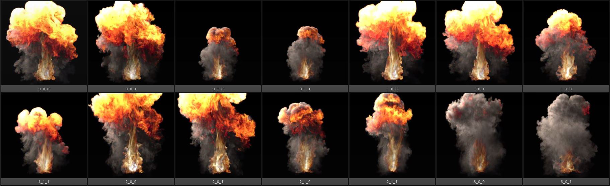
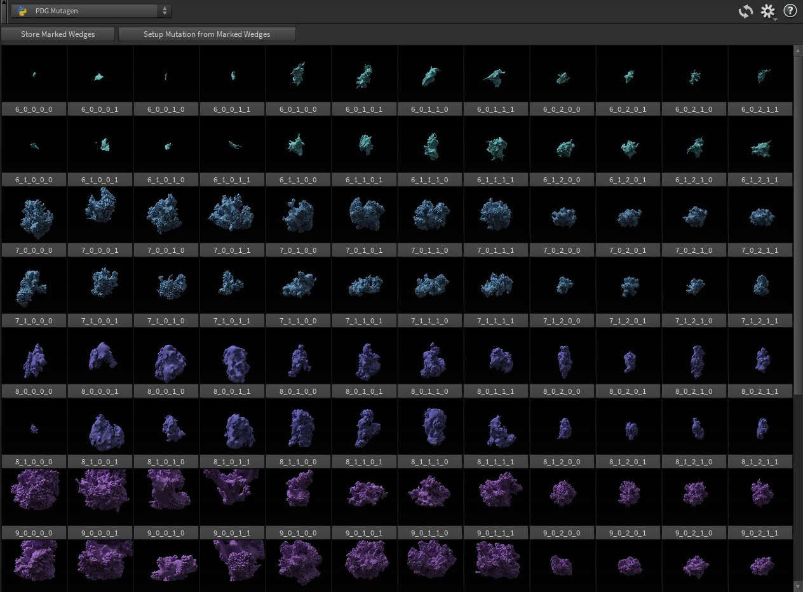
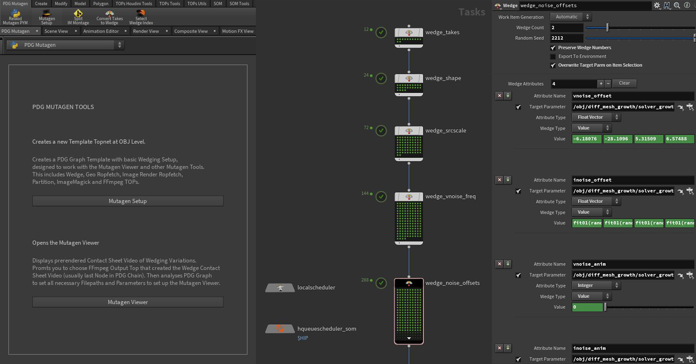

PDG Mutagen
==========================

*Toolset for generating and handling large wedge variation counts in Houdini with PDG/TOPs*

<br>

## About
**PDG Mutagen** is a toolset designed to efficently and intuitively handle the often large wedge variation counts and data amounts when working with PDG wedging in *©SideFX Houdini*.
 

<br>

#### PDG Mutagen Viewer

It includes a Python Panel Interface the **Mutagen Viewer**, that allows you to display and play back the PDG wedge variations
* Allows to visually select a specific wedge variation that will then be selected in the PDG graph as well
* Right click wedge variation to open full-size rendered image sequence in RV or Filebrowser
* Mark/label wedge variations you like, store selection
* **Setup Mutation** tool to generate new base wedge node containing all wedge parameters from marked wedge variations. This can then be used as root to generate further wedge variations based on the settings you liked, by appending further wedge TOPs




<br>

#### PDG Mutagen Shelf

It also includes a **Mutagen Shelf** containing additional utility tools


* **Mutagen Setup** creates a PDG graph template with basic wedging setup, designed to work with the **Mutagen Viewer** and other **Mutagen Tools**.
* **Convert Takes to Wedges** converts variations you have set up in the "classical take style" to a single wedge TOP that holds all the edited parameters. Append additional wedge TOPs as you like to generate further variation
* **Select Wedge Index** lets you numerically enter a target wedge index like *0_1_4_6_2* and select it in the PDG graph. This is handy for large wedge counts where visual selection is tedious or impossible
* **Split IM Montage** splits ImageMagick montage in two separate streams. This is handy for very large wedging setups which become unhandy in a single montage and also ImageMagick concatenation would fail



<br>

### Code State | Bugs | Compatibility
**PDG Mutagen** is in prototype stage and for experimental use.
It may contain bugs and the code is not fully cleaned up. Feel free to customize and enhance to your needs.

*Compatible with **Houdini 17.5.x | Tested with 17.5.299***

<br>

## Videos
* [](https://www.)

* [](https://www.)

<br>

## Installation
* Clone repository. Add path to repository into **HOUDINI_PATH** environment variable (e.g. in *houdini.env* file)
    ```
    HOUDINI_PATH = &;C:/Users/ameyer/Documents/git/pdg_mutagen/houdini
    ```
* Add **PDG Mutagen** shelf to Houdini shelfes

* Open new Python Panel Pane and select **PDG Mutagen**

<br>

## Resources
* [SideFX Pipeline PDG  - Learning Ressources](https://www.sidefx.com/learn/pipeline-pdg/)
* [Entagma PDG for Design - Learning Ressources](https://www.sidefx.com/learn/collections/pdg-for-design/)

<br>

## Future Developement
The intial intention was to create a "smart mutation" tool that will set up the PDG network based on the marked wedge variations automatically.
Hence the name Mutagen, "Mutation Generator".
Providing the user with parameters like "Number of New Variations", "Variation Spread", "Linear or Random Mode" and so on.
Due to time constraints this is unfortunately postponed indefinitely but may be continued in the future.

<br>

## Implementation
Most of the tool is written in *Python 2.7* and *PySide2*, running in the native Houdini Python environment.
The video playback is actually handled by a *HTML5* webpage embedded into *PySide2* with a *QWebEngineWidget*, getting controlled by *JavaScript*.
This is done because the Houdini Python does not ship with the *QtMultimedia Module* (trying to import it from an external Python installation or even *PyQt5* failed), and it might have been hard to get realtime video playback of sometimes 2-6K video with other approaches. This is also the reason why the buttons in the Python Panel interface are actually PySide Widgets, overlayed on top of the HTML page, playing back one big single video. Realtime performance was a more important concideration than flexibility or cleanness of implementation.
The video format must be *WebM* or *Ogg* and not *H264* to be played back in Houdini due to licensing reasons.

<br>

## Thanks
* [Entagma](http://www.entagma.com/) - **PDG for Design Work** series inspired me to create the toolset

<br>